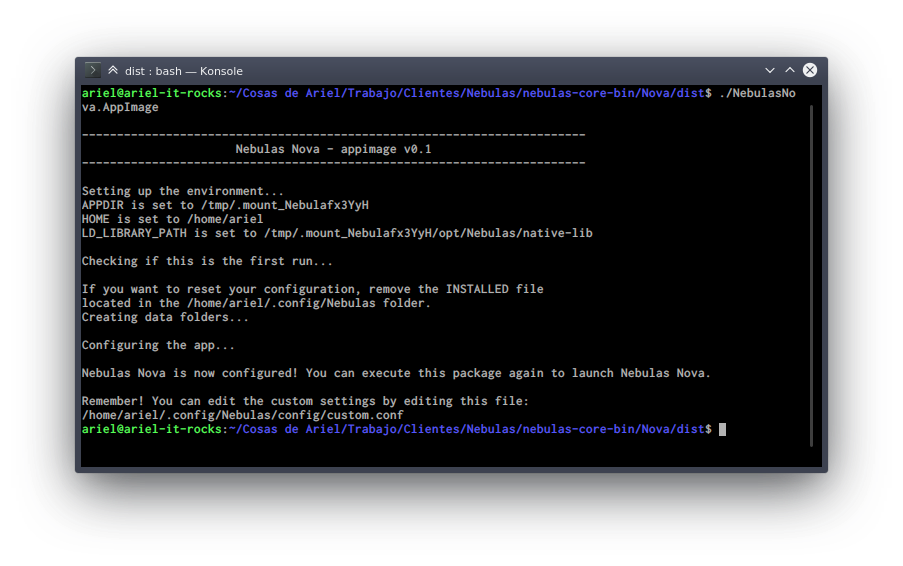
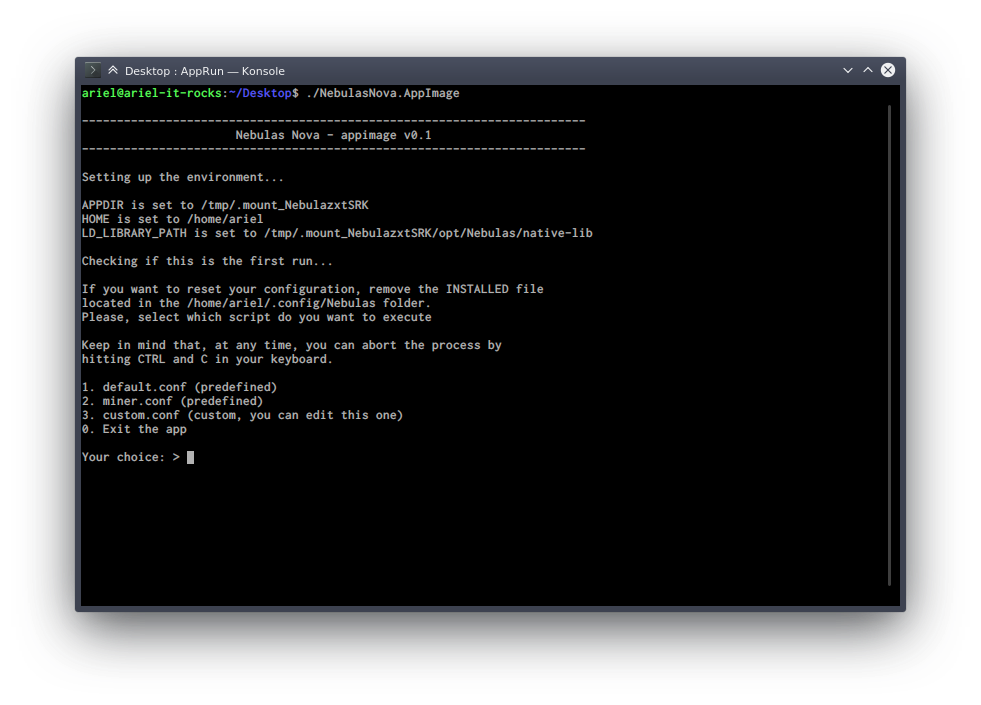
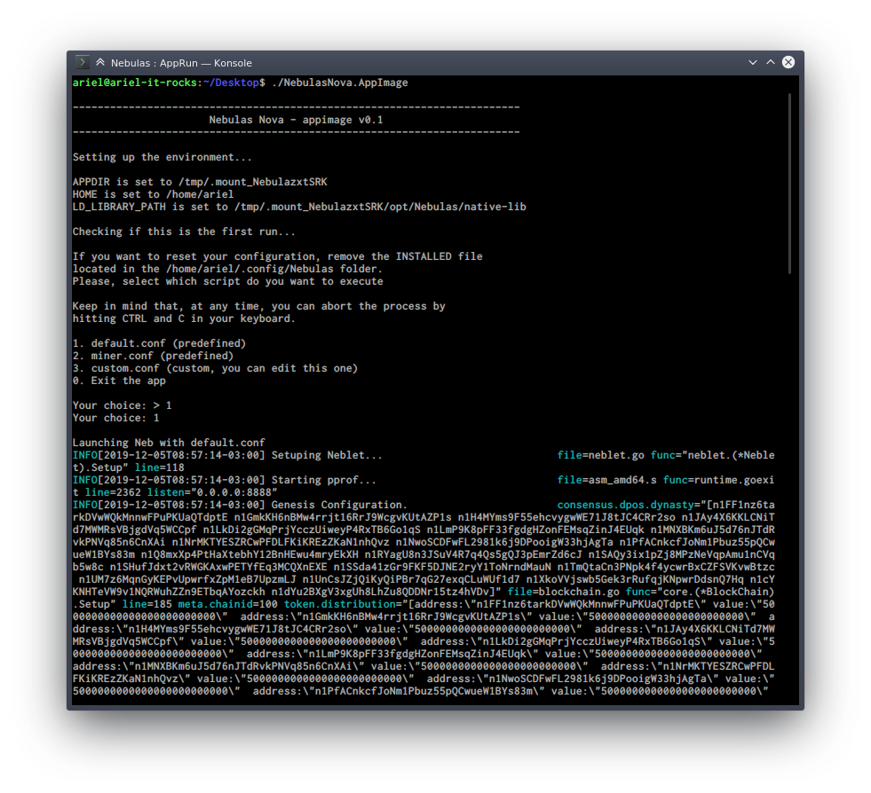

# Nebulas Core Binary Packages

This repo contains the binary packages needed to run a Nebulas node.

The project is still in development.

## Installation

You will find an index for the binary packages in the /dist folder inside each version of Nebulas. For example, the current version is Nebulas Nova, so you will find the index for the packages [here](Nova/dist).

### AppImage

This is a portable version of Nebulas, that can run out-of-the-box in any linux environment.

You need to download the .appimage, set the permissions to +x, and launch it.

#### Downloading

The current version of Nebulas is Nebulas Nova.

Open a console, then type the following:

    mkdir ~/Nebulas
    cd ~/Nebulas
    wget https://arielbecker.com/assets/NebulasNova.AppImage
    chmod +x NebulasNova.AppImage

#### Launching

Now, the only thing you need to do is launch the process. This can be achieved as easily as typing it:

    ./NebulasNova.AppImage

The first time you launch the .appimage, you'll see it copies several files to your user folder. Those are config files needed to run the binary. It will end without launching Nebulas.

If everything's done right, you'll see something like this:

To do so, you just need to launch the script again, as follows:

    ./NebulasNova.AppImage

By launching it a second time, you'll have a prompt asking you to choose between four choices:

Choosing 0 will abort and quit. Choosing 1, 2, or 3 will launch the neb binary with the desired conf file: default.conf, miner.conf, or custom.conf. The latter is a file that you can edit to accomodate your needs; the first two are automatically generated by the script.

If you choose to execute the neb binary with either 1, 2, or 3, it should look like this:

